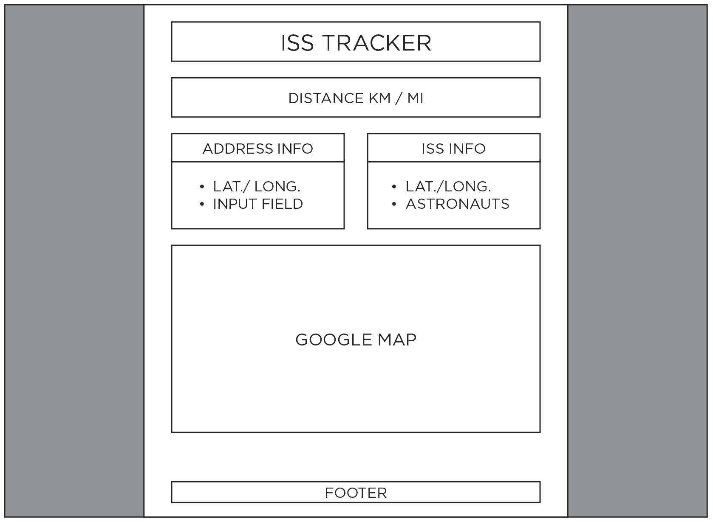

# ISS-tracker
International Space Station tracker

##My learning objectives:
- Using APIs and routing
- Better understanding of server-side and client-side
- TDD

##What it does:
Calculates the distance between the ISS and an address on Earth.

##How it works:
The distance between two sets of longitude and latitude coordinates will be calculated based on the extracted ISS position coordinates using an ISS API and the position coordinates of the address input from the browser.

###MVP:
Server-side:
- Extract ISS coordinates and other information using an ISS API.
- Extract coordinates of an address using a Google API.
- Calculate distance between the two sets of coordinates using js functions.

Client-side:
- Display ISS static coordinates and info.
- Text input field for address on Earth.
- Display the distance between the ISS and the address in km and mi.

###Wireframe:

###Stretch:
- Update ISS coordinates as it moves and have the displayed distance update accordingly.
- Map with clickable marker for address location.
- World map showing marker of address and ISS location.
- Calculate the distance using an API.
